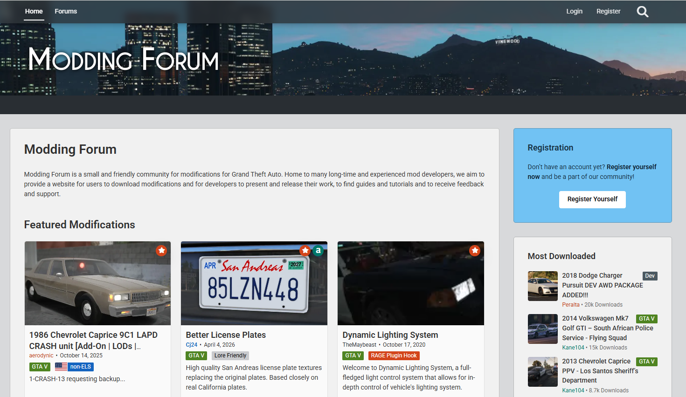

# GTA V modoló klub

GTA V modoló community weboldal

## Ötletek
- Főoldal
- Fórum
- Modok
- Prémium

## Példa

## Adott cél

Egy olyan weboldal létrehozása, ahol a GTA V modolás iránt érdeklődő játékosok
modokat találhatnak, letölthetnek és vásárolhatnak.

A weboldal célja egyrészt egy GTA V modding közösség létrehozása,
ahol a felhasználók fórumon keresztül kommunikálhatnak egymással.

A weboldalon legyen lehetőség:

- Modok megtekintésére
- Modok vásárlására
- Modok letöltésére
- Fórum használatára
- Felhasználói fiók létrehozására
- Prémium tartalmak megvásárlására

## Megrendelői igény

A megrendelő könnyen használható GTA V modoló közösségi
weboldalt szeretne.

## Célközönség

- GTA V játékosok
- GTA V modolók
- FiveM játékosok
- Modkészítők
- GTA V közösségek

## Prémium

A prémium oldalon a fizetős modok találhatók.

A felhasználó kiválaszthatja a számára megfelelő modot,
majd a vásárlás után letöltheti azt.

